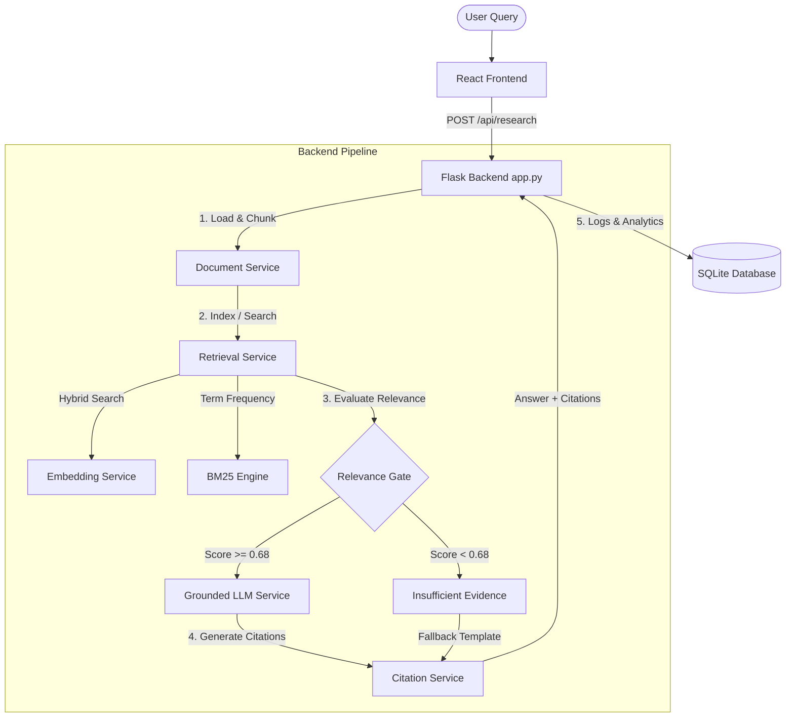

# System Architecture — CEREBRO Research Agent

CEREBRO is structured as a modular full-stack application with a Flask REST API backend and a React single-page application frontend.

---

## Architecture Diagram

---

## Pipeline Components

### 1. Document ingestion and processing (`DocumentService`)
- Reads raw files (`.txt`, `.pdf`, `.docx`) from the `data/knowledge_base/` directory.
- Extracts clean text from files.
- Splits text into overlapping paragraphs of approximately **250 words** with **50 words** of overlap.
- Extracts section headings using regex patterns and stores them as metadata alongside the chunk.

### 2. Hybrid Retrieval (`RetrievalService` & `EmbeddingService`)
- Indexing phase:
  - Generates dense semantic embeddings for every passage chunk using `sentence-transformers/all-MiniLM-L6-v2` (runs locally, 384-dimensional).
  - Fits a BM25 keyword index on all passage chunks.
- Search phase:
  - Computes semantic cosine similarity of query against all chunks.
  - Computes BM25 relevance scores.
  - Combines scores: `combined = 0.6 * semantic + 0.4 * bm25_normalized`.
  - Excludes chunks below the `min_score = 0.30` threshold.

### 3. Relevance Gate & Hallucination Prevention
- A strict evidence gate requires that the maximum raw semantic score across all retrieved chunks must be at least `0.68`.
- If the threshold is not met, the pipeline aborts synthesis and returns a clean "Insufficient Evidence" response.
- This prevents the LLM from synthesizing an answer based on weak, noisy, or off-topic retrieved passages.

### 4. LLM Synthesis & Citations (`LLMService` & `CitationService`)
- Maps the top-K retrieved evidence passages to citation numbers (`[1]`, `[2]`, ...).
- Constructs a grounded prompt enclosing the evidence text and strict rules:
  1. Rely only on the provided evidence.
  2. If the evidence is insufficient, say so.
  3. Include inline citations corresponding to the source numbers.
- Calls the LLM (`gpt-3.5-turbo`) with low temperature (`0.1`) to ensure factual grounding.
- If no OpenAI API key is configured, falls back to a structured keyword extraction summary using the citation labels.

### 5. Persistence (`DBService` & `LoggerService`)
- Logs all user queries, timestamps, response status (answered/unanswered), and referenced sources.
- Persists logs in a lightweight SQLite database (`backend/data/kb_agent.db`).
- Serves analytics metrics (response rate, total query count) to the frontend.
